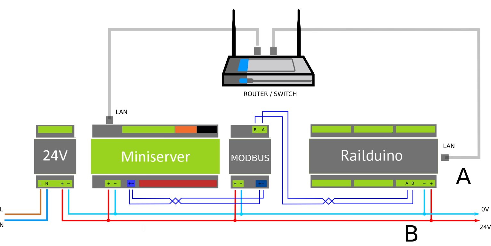

### 4.1 Typical connection

{style="margin: 20px 0 0 0;"}

The Railduino module must be connected to a 12-24V DC power source. 

To fully utilize the module's functions, a connection to a LAN network is required. 
An additional optional connection to RS485 is possible. 

When paired with a superior system (e.g., Loxone), communication can occur in two ways: A - via LAN, B - via RS485.

RS485 bus can be terminated with the use of integrated terminator – *see [DIP switch settings](/RAILDUINO/installation/#32-dip-switch-settings)*

### 4.2 Communication settings

Default communication settings of the Railduino module:

#### LAN network  

- UDP incoming port 55555  
- UDP outgoing port 44444
- MODBUS TCP port 502  
- IP address - dynamic – DHCP server must be present

#### RS485 serial bus  

- Communication speed adjustable via webserver - default 115200Bd
- Number of data bits 8  
- Number of stop bits 1  
- Parity none

