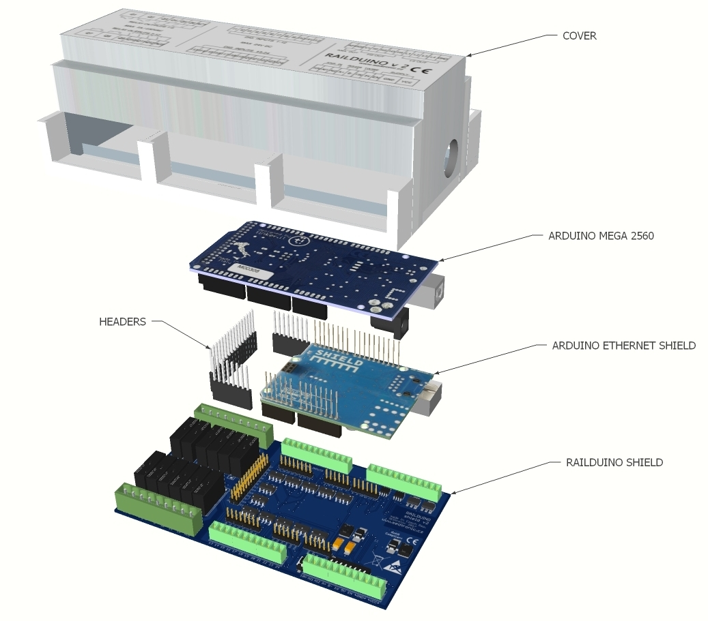
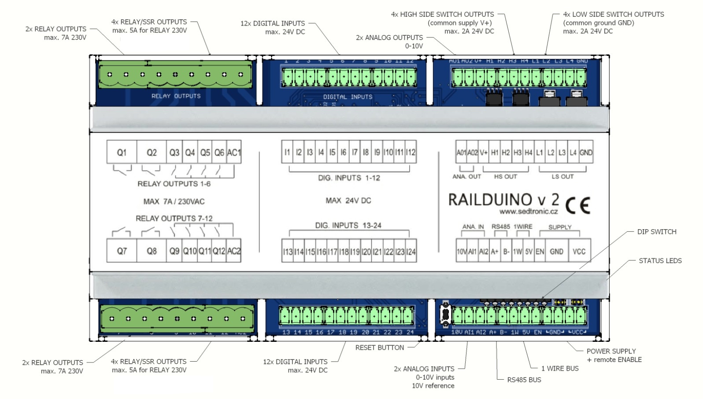

### 2.1 Concept
The Railduino module comprises of the following basic parts:

#### Arduino MEGA 2560 R3

A printed circuit board with a microcontroller in form of an 8-bit processor ATmega 2560 with the 
frequency of 16 MHz, known as Arduino MEGA 2560 -- an open-source project -- more can be found on http://arduino.cc/.

#### Railduino shield

Main PCB board enabling connection of all the outside sensors and actuators to the controller, which adjust the signals so that the microcontroller can read or control them.
In addition, this board ensures all power supply and communication.

#### Ethernet shield

An additional (optional) PCB which offers a possibility to connect the whole system to the Ethernet network.
When this function is used then the Railduino module is additionally equipped with the headers connectors between shield and Railduino shield.

{: style="margin: 0 0 0 120px; max-height:600px" }

### 2.2 Product Description

The Railduino module is a device designed to work with a superior control system (e.g., Loxone) as remote inputs/outputs.  
It enables control of external equipment (e.g., lights, pumps, breakers) and reading values from inputs (e.g., push buttons, contacts).

#### Outputs / inputs:  
- 24x optically isolated digital inputs, max. input voltage 24V DC
- 12x relay outputs with max. current 7A / 4A at 230V AC
- 4x high-side switch (HSS) digital outputs - switching V+ voltage - max. 24V DC, 2A / channel
- 4x low-side switch (LSS) digital outputs - switching GND - max. 24V DC, 2A / channel
- 2x analog inputs (0-10V range), resolution 10 bits (0-1023) 
- 2x analog outputs (0-10V range), resolution 8 bits (0-255)

#### Communication:  
- LAN connectivity - Modbus TCP / UDP
- RS485 serial bus - Modbus RTU, gateway to LAN, baudrate selectable
- 1-Wire bus - supports Maxim/Dallas DS18B20 or DS2438 (max. 10pcs)

#### Other functions
- webserver for settings
- watchdog for processor, LAN
- remote restart - SW and HW reset
- high speed dig. inputs
- serial debug mode
- RS485-LAN gateway
- DIP switch settings
- USB for debug purposes
- LED diodes - indication of operation
- Reset button - restart of the module

{ style="margin: 20px 0 0 0" }