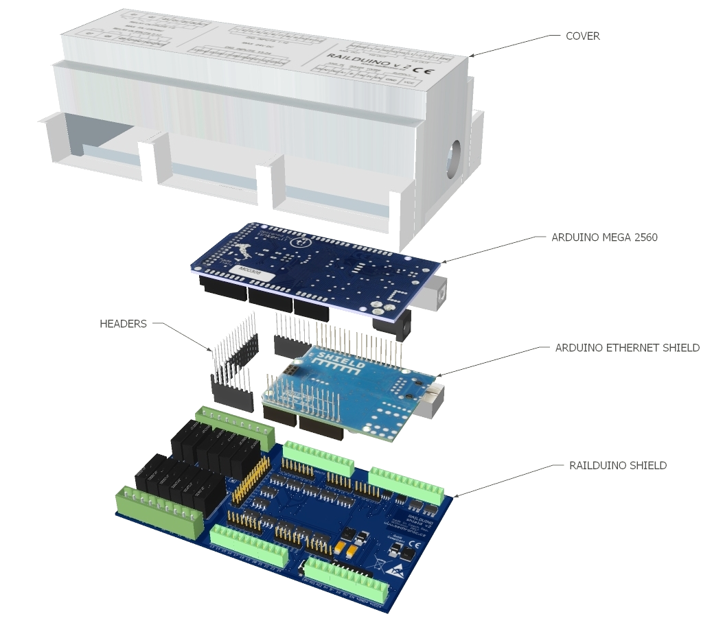

## Basic Concept
The Railduino module consists of the following main components:

:simple-arduino: &nbsp; **Arduino MEGA 2560 R3**  
A printed circuit board featuring an 8-bit ATmega2560 microcontroller operating at a frequency of 16 MHz, 
known as the Arduino MEGA 2560, an open-source project. For more information, visit [Arduino Official Site](https://arduino.cc)

:fontawesome-solid-microchip: &nbsp; **Railduino shield**  
The primary PCB enables the connection of external sensors and actuators to the controller, conditioning 
signals so that the microcontroller can read or control them. Additionally, this board provides power supply and communication functionality.

:material-ethernet: &nbsp; **Ethernet shield**  
An optional PCB that enables connection to an Ethernet network. When this feature is used, the Railduino
 module is equipped with header connectors between the Ethernet shield and the Railduino shield.

<figure markdown="span">
{loading=lazy }
</figure>

## Product Description

The Railduino module is designed to integrate with a supervisory control system (e.g., Loxone) as remote inputs and outputs.
 It enables control of external equipment (e.g., lights, pumps, breakers) and reading values from inputs (e.g., push buttons, contacts).

### Outputs / inputs  
- 24x optically isolated digital inputs, input voltage 12-24V DC
- 12x relay outputs with max. current 7A / 4A at 230V AC
- 4x high-side switch (HSS) digital outputs - switching V+ voltage - max. 24V DC, 2A / channel / PWM
- 4x low-side switch (LSS) digital outputs - switching GND - max. 24V DC, 2A / channel / PWM
- 2x analog inputs (0-10V range), resolution 10 bits (0-1023) 
- 2x analog outputs (0-10V range), resolution 8 bits (0-255)

### Communication  
- LAN connectivity - Modbus TCP / UDP
- RS485 serial bus - Modbus RTU, gateway to LAN, baudrate selectable
- 1-Wire bus - supports Maxim/Dallas DS18B20 or DS2438 (max. 10pcs)

### Other functions
- webserver for settings
- watchdog for processor, LAN
- remote restart - SW and HW reset
- high speed dig. inputs
- serial debug mode
- RS485-LAN gateway
- DIP switch settings
- USB for debug purposes
- LED diodes - indication of operation
- Reset button - restart of the module

<figure markdown="span">
{ loading=lazy}
</figure>