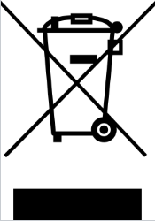

### 1.1 Symbols used

>{: style="float: left; margin: 0 20px 0 0; max-width: 25px;" }
>
A warning sign, for safe use these instructions must be followed

>{: style="float: left; margin: 0 20px 0 0; max-width: 25px;" }
>
CE marking, certifies compliance of the product with the legal requirements

>{: style="float: left; margin: 0 20px 0 0; max-width: 25px;" }
>
The product does not belong to municipal waste and is subject to separate collection

### 1.2 Safety warnings

>{: style="float: left; margin: 0 20px 0 0; max-width: 30px;" }
>

>To prevent electrical shock and fire,
>follow these safety instructions and guidelines. Do not exceed the
>technical parameters and use the device according to the following
>description. Read the instructions carefully before putting the device
>into operation. The device should be installed only by a qualified
>technician. Use of the device in any other way than the way recommended
>by the manufacturer may undermine the protection provided by the device.
>Do not connect the device to the power supply (dangerous voltage) unless
>it is being installed. Repairs of the module can be carried out only by
>the manufacturer.
>
 

>{: style="float: left; margin: 0 20px 0 0; max-width: 30px;" }
>In an applications with the connection
>of main voltage of 230V to the output terminals of the device a
>sufficient distance or insulation from the wires, clamps and enclosing
>against the surroundings must be provided, due to preservation of
>protection against electric shock. Behind the front cover of the
>device there are output terminals, where dangerous voltage can occur.
>
 

>In the Czech Republic only a qualified person is allowed to install the
>device (a person min. skilled according to Act No. 250/2021 Coll.
>after familiarization with these instructions. The device must not
>be used otherwise than in accordance with these instructions.
>
 

>To prevent risk of electical injury or fire the maximal operation
>parameters of the device must not be exceeded, particularly the range of
>operational temperatures due to heat impact from connected or other
>technological equipment nearby!
>
 

>Protect the device from a direct sun light, dust, high temperature,
>mechanical vibrations and impact, from rain and high moisture. In case
>of increased ambient temperature above the mentioned limit a ventilation
>must be ensured.
>

### 1.3 Delivery and packaging description

The product is wrapped in a protective electrostatic packaging and
placed in a cardboard box. The product must not be exposed to direct
rain, vibrations and impacts during the transport.

### 1.4 Storage

The products are stored in dry non-condensing areas with temperature -40
up to +85 °C.

### 1.5 Installation and commisioning

The device should be installed only by technicians, who are acquainted
with the technical terms, warnings and instructions and who are able to
adhere to these instructions. If there are any doubts regarding the
right handling with the module, do not hesitate to contact the local
distributor or the manufacturer.

Mounting and connection of the device should meet the national
legislation governing installations of electric materials, i. e.
diameter of conductors, protective fuses and positions. The Railduino
Module is intended to be mount on the DIN rail in compliance with the
standard EN 60715 or the PR-TS 35 type.

When installing, commissioning, operating and during maintenance pay
attention to the instructions mentioned in the chapter 4.

### 1.6 Spare parts

Each compact part of the product, for which no special procedures or
technological operations are necessary when exchanging, can be also
ordered as a spare part.

### 1.7 Repairs

The products are repaired by the manufacturer. For repair the products
are sent in a packaging, which ensures shock absorbtion and protects
against damage during transportation.

### 1.8 Warranty

The product is covered by 2 years warranty from the date of delivery
specified on the delivery note. The manufacturer warrants the
technical and operation parameters of the products to the extent of
valid documentation. The warranty period begins from the date of
taking over the goods by the buyer or by a carrier. The manufacturer
is not liable for defects caused by improper storage, improper
external connections, external factors, particularly by quantities of
inadmissible sizes, unqualified mounting, incorrect adjustment,
improper use or normal wear and tear.

### 1.9 Termination of operation and disposal
{: style="float: left; margin: 0 20px 0 0; max-width: 30px;" }

During termination of operation, the
dismantling and disposal are possible to execute only after the power
supply is disconnected.

If the product Railduino is not further used, or should it be replaced
with a new one, it is not disposed with the general household waste.
Disposal of this product must be performed in a separate collection.
Separate collection allows for recycling and reuse of used products
and packaging materials. Reuse of recycled materials helps prevent
environmental pollution and reduces the demand for raw materials. When
buying new products, stores, local waste disposal or recycling plants
will provide information on proper disposal of electronic waste.

To avoid damage of the environment or human health from uncontrolled
disposal, we recommend to contact the seller for information on safe
disposal of this product.

