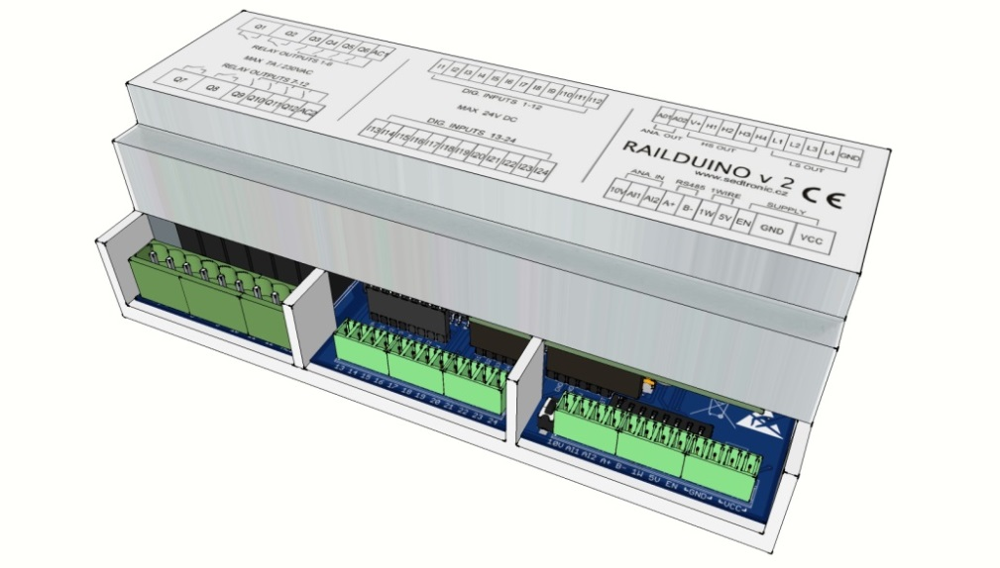

#RAILDUINO 2.1#

##OPERATING INSTRUCTIONS##

>Content

[1 - General](./general.md)  
[2 - Description](./description.md)  
[3 - Installation](./installation.md)  
[4 - Connection](./connection.md)  
[5 - Modbus](./modbus.md)  
[6 - UDP](./udp.md)  

