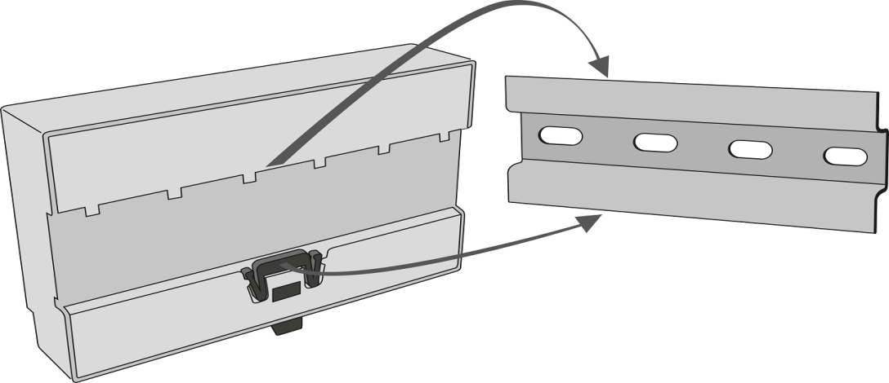
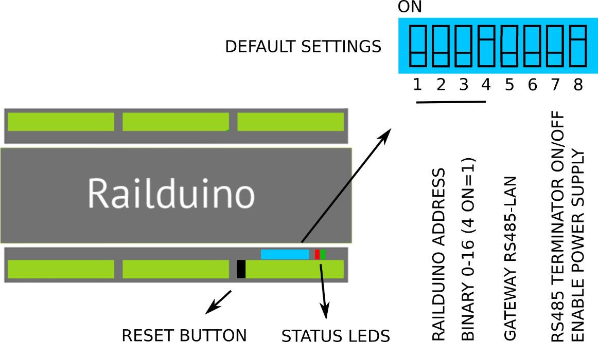

### 3.1 Assembly

Mounting onto DIN rail -- click the Railduino Module onto the DIN rail (TS 35) as in the picture.

{style="max-height:200px; margin: 20px 0 0 180px;"}

### 3.2 DIP switch settings 

- PIN 1: x = 4/4 bit of physical address - highest
- PIN 2: x = 3/4 bit of physical address
- PIN 3: x = 2/4 bit of physical address
- PIN 4: x = 1/4 bit of physical address - lowest
- PIN 5: x = Gateway OFF, o = Gateway ON
- PIN 6: x = RESERVED
- PIN 7: x = TERMIN. OFF, o = TERMIN. ON  
- PIN 8: x = HW ENABLE OFF, o = HW ENABLE ON

{style="max-height:300px; margin: 0 0 0 180px;"}

### 3.2 Status LEDs

- BLUE LED
    - **do not lit**: no power supply or failure, boot up phase
    - **flashes 1 Hz**: device operating OK
    - **lit**: awaiting IP address

- GREEN LED
    - **do not lit**: no communication in progress
    - **lit**: communication in progress
