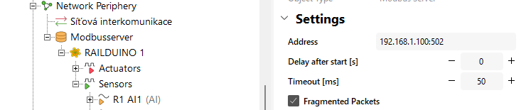
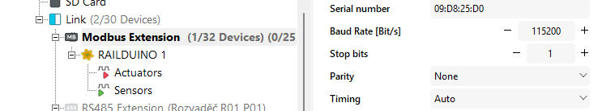

# Modbus settings
!!! note "Modbus TCP and RTU"
	- Modbus TCP is used for communication over LAN - functions FC: 1, 2, 3, 4, 5, 6, 15, 16
	- Modbus RTU is used for communication over RS485 - functions FC: 3, 6, 16

## Modbus register map

!!! warning "Modbus register map structure"
	- Each Modbus register consists of 2 bytes (16 bits).  
	- Ensure that values are written to and read from the least significant byte to avoid data misalignment.  
	- **Only the least significant byte (LSB) is used to store values.**
   
   
>      0 - bits 0-7: relay outputs 1-8  
>      1 - bits 16-19: relay outputs 9-12  
>      2 - bits 32-39: digital outputs HSS 1-4, LSS 1-4  
>      3 - LSB: HSS PWM value 1 (0-255)  
>      4 - LSB: HSS PWM value 2 (0-255)  
>      5 - LSB: HSS PWM value 3 (0-255)  
>      6 - LSB: HSS PWM value 4 (0-255)  
>      7 - LSB: LSS PWM value 1 (0-255)  
>      8 - LSB: LSS PWM value 2 (0-255)  
>      9 - LSB: LSS PWM value 3 (0-255)  
>      10 - LSB: LSS PWM value 4 (0-255)  
>      11 - LSB: analog output 1  
>      12 - LSB: analog output 2  
>      13 - bits 208-215: digital inputs 1-8  
>      14 - bits 216-223: digital inputs 9-16  
>      15 - bits 224-231: digital inputs 17-24  
>      16 - LSB: analog input 1 0-1023  
>      17 - LSB: analog input 2 0-1023  
>      18 - bit 288: reset (bit 0)  
>      19 - LSB: 1st DS2438 Temp (value multiplied by 100)  
>      20 - LSB: 1st DS2438 Vad (value multiplied by 100)  
>      21 - LSB: 1st DS2438 Vsens (value multiplied by 100)  
>      -  
>      46 - LSB: DS2438 values (up to 10 sensors)  
>      47-57: DS18B20 Temperature (up to 10 sensors) (value multiplied by 100)

## Loxone Modbus TCP settings

!!! tip "Insert new **Modbus server** and set IP and port "502" in the Modbus server settings"
	<figure markdown="span">
	
	</figure>

!!! tip "Create new **Modbus device** - and set/leave the address "1" of the Modbus client (Railduino module)"
	<figure markdown="span">
	
	</figure>
	This is NOT the physical address of the device

## Loxone Modbus RTU settings

!!! tip "In the **Modbus extension** settings set the baudrate "115200", stop bits "1" and parity "none""
	<figure markdown="span">
	  
	</figure>
	
!!! tip "Create new **Modbus device** and set/leave the address "1" of the Modbus client (Railduino module)"
	<figure markdown="span">
	  
	</figure>
