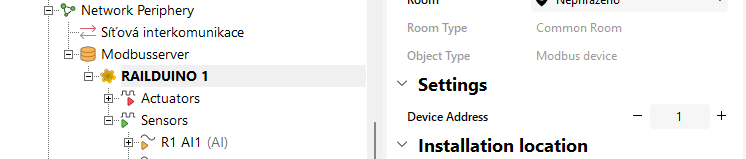

### 5.1 Modbus protocol

- Modbus TCP is used for communication over LAN - functions FC: 1, 2, 3, 4, 5, 6, 15, 16
- Modbus RTU is used for communication over RS485 - functions FC: 3, 6, 16

The states of the digital inputs must be read in full bytes from the registers of the Railduino module

### 5.2 Loxone Modbus TCP settings

{style="margin: 20px 0 20px 0; border:1px solid" }
Insert new **Modbus server** and set IP and port in the Modbus server settings

{style="margin: 20px 0 20px 0; border:1px solid" }
Create new **Modbus device** - and set/leave the address "1" of the Modbus client (Railduino module)  
This is NOT the physical address of the device!

### 5.3 Loxone Modbus RTU settings

{style="margin: 20px 0 20px 0; border:1px solid" }  
Insert new **Modbus device** and set the baudrate, stop bits and parity of the device (Railduino module)  

### 5.3 Modbus register map

Modbus register map (1 register = 1 byte = 8 bits)
   
>      0: relay outputs 1-8  
>      1: relay outputs 9-12  
>      2: digital outputs HSS 1-4, LSS 1-4  
>      3: HSS PWM value 1 (0-255)  
>      4: HSS PWM value 2 (0-255)  
>      5: HSS PWM value 3 (0-255)  
>      6: HSS PWM value 4 (0-255)  
>      7: LSS PWM value 1 (0-255)  
>      8: LSS PWM value 2 (0-255)  
>      9: LSS PWM value 3 (0-255)  
>      10: LSS PWM value 4 (0-255)  
>      11: analog output 1  
>      12: analog output 2  
>      13: digital inputs 1-8  
>      14: digital inputs 9-16  
>      15: digital inputs 17-24  
>      16: analog input 1 0-1023  
>      17: analog input 2 0-1023  
>      18: reset (bit 0)  
>      19: 1st DS2438 Temp (value multiplied by 100)  
>      20: 1st DS2438 Vad (value multiplied by 100)  
>      21: 1st DS2438 Vsens (value multiplied by 100)  
>      -  
>      46: DS2438 values (up to 10 sensors)  
>      47-57: DS18B20 Temperature (up to 10 sensors) (value multiplied by 100)

