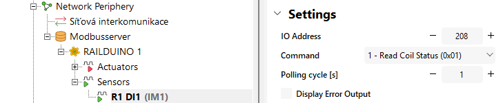
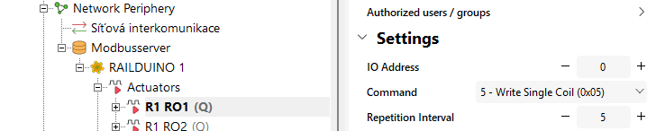
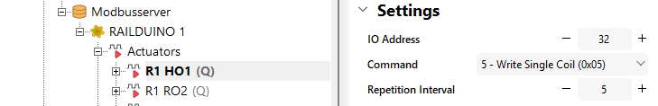
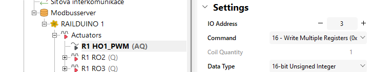
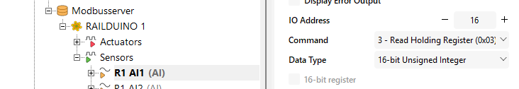
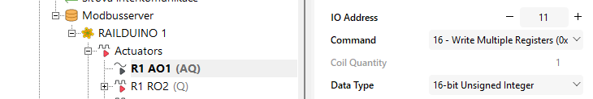
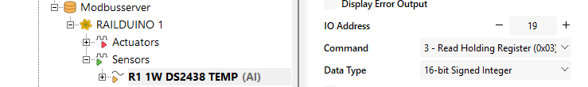

## Digital inputs example

!!! warning "Modbus polling cycle limitation"
	There is a minimum polling cycle of up to 0.1 seconds for 2 Modbus inputs per unit. The minimum polling cycle is 1 second for all other Modbus sensors.

!!! example "Example of reading out state of dig. input no. 1"
	Insert new **Modbus digital sensor** with the settings IO address "208", Command "1", polling cycle "1"
	<figure markdown="span">
	
	</figure>
	

## Relay outputs example

!!! Warning "Relay outputs limitation"
	- Max. permissible voltage at relay outputs is 230V AC  
	- Max. perm. load current is 7A at relay outputs no. 1,2,7,8  
	- Max. perm. load current is 4A at relay outputs no. 3,4,5,6,9,10,11,12  

!!! example "Example of settings for controlling relay output no. 1"
	Insert new **Modbus digital actor** with the settings IO address "0", Command "5", repeat cycle "5"
	<figure markdown="span">
	
	</figure>

## HSS/LSS outputs example

!!! Warning "HSS/LSS outputs limitation"
	- Max. permissible voltage at V+ terminal is 24V DC  
	- Max. perm. load current is 2A per each channel
	
!!! example "Example of settings for controlling HSS output no. "1" (HO1) as binary output"
	Insert new **Modbus digital actor** with the settings IO address "32", Command "5", repeat cycle "5"
	<figure markdown="span">
	
	</figure>
	
!!! example "Example of settings for controlling HSS output no. "1" (HO1) as PWM output"
	Insert new **Modbus analog actor** with the settings IO address "3", Command "16", data type "16-bit unsigned int"
	<figure markdown="span">
	
	</figure>
	
## Analog inputs/outputs example

!!! Warning "Analog inputs/outputs limitation"
	- Max. permissible voltage at analog input terminal is 10V DC  
	- Max. perm. load current at analog. output terminal is 20 mA

!!! example "Example of settings for sensing analog input no. "1" (AI1)"
	Insert new **Modbus analog sensor** with the settings IO address "16", Command "3", repeat cycle "5"
	<figure markdown="span">
	
	</figure>
	
!!! example "Example of settings for controlling analog output no. "1" (AO1)"
	Insert new **Modbus analog actor** with the settings IO address "11", Command "16", data type "16-bit unsigned int"
	<figure markdown="span">
	
	</figure>
	
## 1-wire sensors example

!!! example "Example of settings for sensing 1-wire sensor no. 1 temperature"
	Insert new **Modbus analog sensor** with the settings IO address "19", Command "3", data type "16-bit signed int"
	<figure markdown="span">
	
	</figure>
