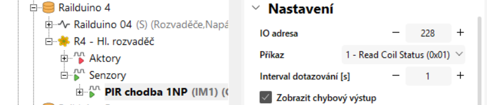

## Digital inputs example

!!! warning "Modbus polling cycle limitation"
	There is a minimum polling cycle of up to 0.1 seconds for 2 Modbus inputs per unit. The minimum polling cycle is 1 second for all other Modbus sensors.

!!! example "Example of reading out state of dig. input no. 13"
	Insert new **Modbus digital sensor** with the settings e.g. IO address 228, Command 1, polling cycle 1s
	<figure markdown="span">
	
	</figure>
	

## Relay outputs example

!!! Warning "Relay outputs limitation"
	- Max. permissible voltage at relay outputs is 230V AC  
	- Max. perm. load current is 7A at relay outputs no. 1,2,7,8  
	- Max. perm. load current is 4A at relay outputs no. 3,4,5,6,9,10,11,12  

!!! example "Example of communication for controlling relay output no. 7"
	Insert new **Modbus digital actor** with the settings e.g. IO address 6, Command 5, repeat cycle 5s
	<figure markdown="span">
	
	</figure>

