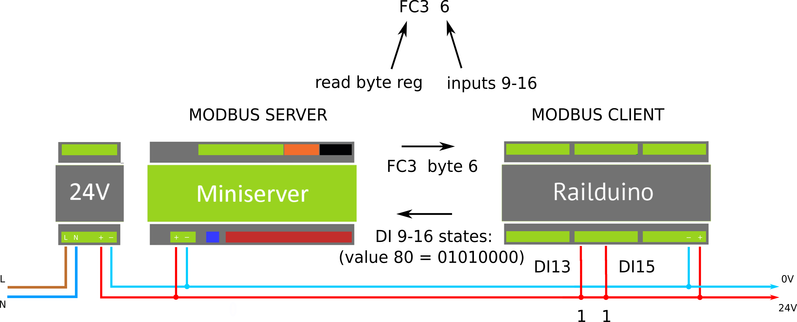
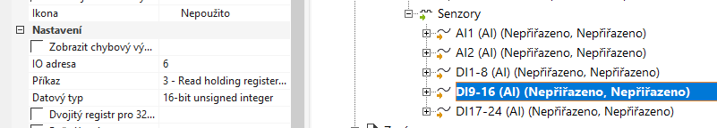
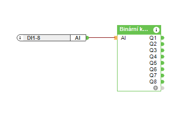
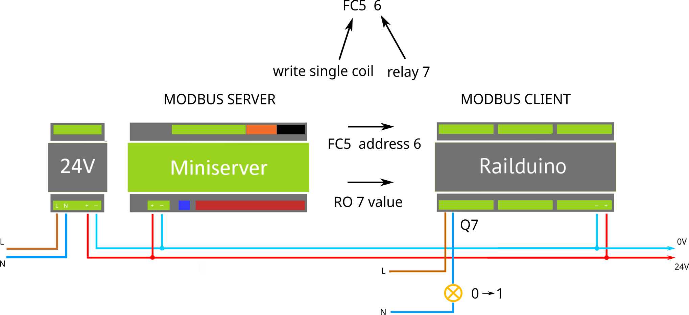
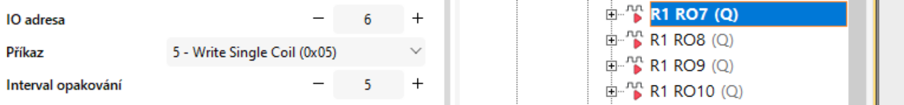

### 7.1 Digital inputs example

When the change at the digital input is recognized – e.g. push button is pressed, Railduino module changes the state of the register bytes 13-15.  

Superior control system can read the values e.g. with the FC3 command.  

{style="margin: 20px 0 0 0; width: 100%" } 

Example of communication for reading out state of dig. inputs

{style="margin: 20px 0 20px 0; width: 100%; border: 1px solid" }  
Insert new **Modbus analog sensor** with the settings for sensing dig. inputs in Loxone Config - e.g. IO address 6, Command 3, data type 16-bit unsigned int. 

 
For reading of any input of Railduino Module (digital, analog, 1wire), it is always necessary to insert an analog sensor in the Loxone configuration
 (under Modbus device) and decode its value:

{style="margin: 20px 0 20px 0; border: 1px solid" }  
Example of using binary decoder block in Loxone Config
 

### 7.2 Relay outputs example

{ style="float: left; margin: 0 20px 0 0; max-width: 30px;" }
*Max. permissible voltage at relay outputs is 230V AC!*  

{ style="float: left; margin: 0 20px 0 0; max-width: 30px;" }
*Max. perm. load current is 7A at relay outputs no. 1,2,7,8*  

{ style="float: left; margin: 0 20px 0 0; max-width: 30px;" }
*Max. perm. load current is 4A at relay outputs no. 3,4,5,6,9,10,11,12*  

The Railduino module switches ON the relay output once the command is received using Modbus register bytes 0 and 1.

Superior control system can control the relay output using the Modbus FC5 command - e.g. relay 1 with bit 0:

{style="margin: 0 0 20px 0;  width: 100%" } 
Example of communication for controlling relay output no. 7

{style="margin: 20px 0 20px 0; width: 100%; border: 1px solid" } 
Insert new **Modbus digital actor** with the settings for controlling relay outputs in Loxone Config - e.g. IO address 6, Command 5 for relay output 7.
 

