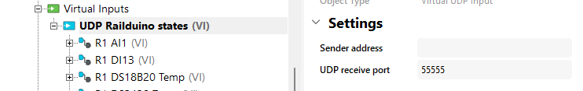

## User data protocol - UDP

!!! note "Basic syntax"
	>"rail" + [add.] + " " + "[cmd]" + [no.] + "[state]"  
	
	e.g. "rail1 ro12 on"  where  
	
	- [add.] is physical address of Railduino  
	- [cmd] is command/signal  
	- [no.] is number of input/output  
	- [state] is e.g. on/off for output, 0/1 for input etc  

Commands / Outputs:
>      - relay on command: "rail1 ro12 on"  
>      - relay off command: "rail1 ro5 off"  
>      - high side switch on command: "rail1 ho2 on"  
>      - high side switch off command: "rail1 ho4 off"  
>      - high side switch PWM command: "rail1 ho1_pwm 180"
>      - low side switch on command: "rail1 lo1 on"  
>      - low side switch off command: "rail1 lo2 off"  
>      - low side switch PWM command: "rail1 lo1_pwm 180"  
>      - analog output command: "rail1 ao1 180"  
>      - reset command: "rail1 rst"

Signals / Inputs: 
>      - digital input state: "rail1 di1 1"  
>      - analog input state: "rail1 ai1 1020"
>      - DS18B20 1wire sensor packet: "rail1 1w 2864fc3008082 25.44"  
>      - DS2438 1wire sensor packet: "rail1 1w 2612c3102004f 25.44 1.23 0.12"

## Loxone UDP settings for inputs

!!! tip "Insert new UDP virtual input for sensing inputs in Loxone Config and set the **UDP receive port** to 55555"
	<figure markdown="span">
	
	</figure> 

## Loxone UDP settings for outputs

!!! tip "Insert new UDP virtual output and set the outcoming address /dev/udp/192.168.x.x/44444"
	<figure markdown="span">
	
	</figure> 

