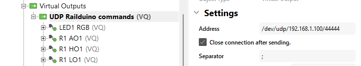

### 6.1 User data protocol - UDP

Basic syntax:
>      "rail" + add. + " " + "cmd" + no. + "state"  e.g. "rail1 ro12 on" 

Commands / Outputs:
>      - relay on command: "rail1 ro12 on"  
>      - relay off command: "rail1 ro5 off"  
>      - high side switch on command: "rail1 ho2 on"  
>      - high side switch off command: "rail1 ho4 off"  
>      - high side switch PWM command: "rail1 ho1_pwm 180"
>      - low side switch on command: "rail1 lo1 on"  
>      - low side switch off command: "rail1 lo2 off"  
>      - low side switch PWM command: "rail1 lo1_pwm 180"  
>      - analog output command: "rail1 ao1 180"  
>      - reset command: "rail1 rst"

Signals / Inputs: 
>      - digital input state: "rail1 di1 1"  
>      - analog input state: "rail1 ai1 1020"
>      - DS18B20 1wire sensor packet: "rail1 1w 2864fc3008082 25.44"  
>      - DS2438 1wire sensor packet: "rail1 1w 2612c3102004f 25.44 1.23 0.12"

### 6.2 Loxone UDP settings for inputs

{style="margin: 20px 0 20px 0; border:1px solid" }  
Insert new **UDP virtual input** for sensing inputs in Loxone Config and set the **UDP receive port** to 55555

### 6.3 Loxone UDP settings for outputs

{style="margin: 20px 0 20px 0; border:1px solid" }  
Insert new **UDP virtual output** for controlling outputs in Loxone Config and set the outcoming address with the IP address of the Railduino module:
>/dev/udp/192.168.1.123/44444

