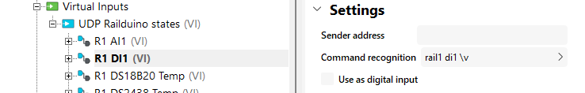
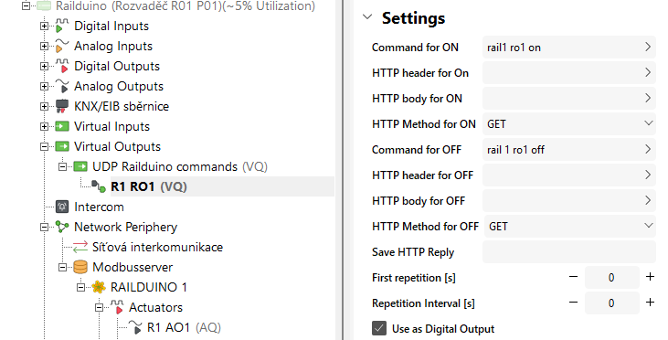
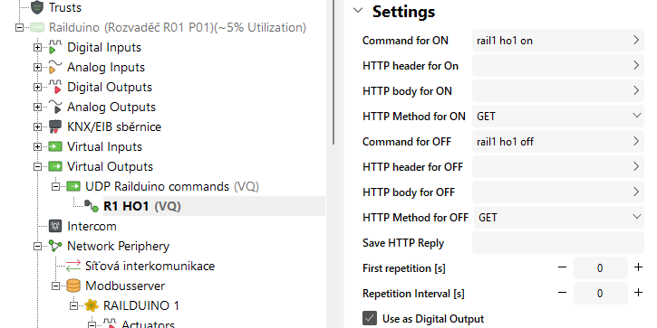
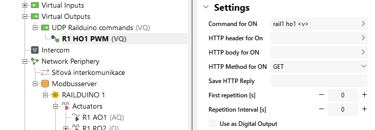
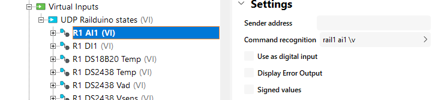
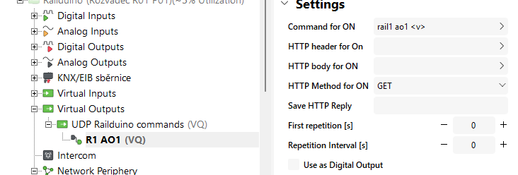
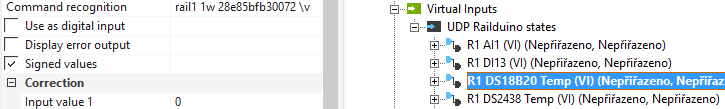
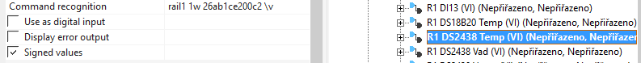
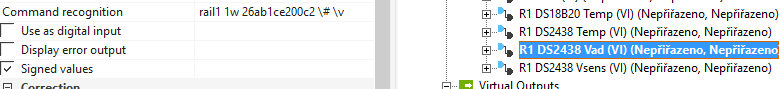
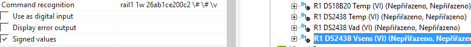

## Digital inputs example

!!! warning "UDP virtual input settings"
	Please make sure that "Use as digital input" checkbox is UNCHECKED in the UDP virtual input settings!

!!! example "Example of reading out state of dig. input no. 1"
	Insert new **Virtual UDP input command** with the command recognition "rail1 di1 \v" (Railduino address 1)"
	<figure markdown="span">
	
	</figure>  
 
## Relay outputs example

!!! Warning "Relay outputs limitation"
	- Max. permissible voltage at relay outputs is 230V AC  
	- Max. perm. load current is 7A at relay outputs no. 1,2,7,8  
	- Max. perm. load current is 4A at relay outputs no. 3,4,5,6,9,10,11,12  

!!! example "Example of settings for controlling relay output no. 1"
	Insert new **Virtual output command** with the "rail1 ro1 on" in Command for ON and "rail1 ro1 off" in Command for OFF
	<figure markdown="span">
	
	</figure>

## HSS/LSS outputs example

!!! Warning "HSS/LSS outputs limitation"
	- Max. permissible voltage at V+ terminal is 24V DC  
	- Max. perm. load current is 2A per each channel
	
!!! warning "Virtual output settings"
	Please make sure that "Use as digital output" checkbox is checked according to use of HSS/LSS - binary or PWM!
	
!!! example "Example of settings for controlling HSS output no. "1" (HO1) as binary output"
	Insert new **Virtual output command** with the "rail1 ho1 on" in Command for ON and "rail1 ho1 off" in Command for OFF
	<figure markdown="span">
	
	</figure>
	
!!! example "Example of settings for controlling HSS output no. "1" (HO1) as PWM output"
	Insert new **Virtual output command** with the "rail1 ho1_pwm <v\>" in Command for ON
	<figure markdown="span">
	
	</figure>

## Analog inputs example

!!! warning "Analog inputs/outputs limitation"
	- Max. permissible voltage at analog input terminal is 10V DC  
	- Max. perm. load current at analog. output terminal is 20 mA

!!! info "Analog inputs/outputs resolution"
	- Analog inputs measured values are sent in 10-bit format (0-1028), e.g. 514 = 5V
	- Analog outputs are set with 8-bit format (0-255), e.g. 5V = 128
	- Analog outputs have common ground at the GND terminal, which is connected to 0V of Railduino module.
	- Default cycle for measuring analog inputs is 10s  

!!! example "Example of settings for sensing analog input no. "1" (AI1)"
	Insert new **Virtual UDP input command** with the command recognition "rail1 ai1 \v" (Railduino address 1)"
	<figure markdown="span">
	
	</figure>
	
!!! example "Example of settings for controlling analog output no. "1" (AO1)"
	Insert new **Virtual output command** with the "rail1 ao1 <v\>" in Command for ON
	<figure markdown="span">
	
	</figure>

## 1-wire sensors example

!!! warning "UDP virtual input settings"
	Please make sure that "Use as digital input" checkbox is UNCHECKED in the UDP virtual input settings!

!!! info "Analog inputs/outputs resolution"
	- It is possible to connect up to 10pcs of 1-wire sensors to the module
	- Supported types of the 1wire sensors
		- DS2438 – e.g. Unica 1wire modules  
		- DS18B20  
	- Default cycle for measuring 1-wire sensors is 30s for each sensor

!!! example "Example of command recognition settings for measurement of **temperature (sensor DS18B20)**"
	Insert new **Virtual UDP input command** with the command recognition "rail1 1w 28ff41778016559 \v" (serial number of 1wire sensor)"
	<figure markdown="span">
	
	</figure>
	
!!! example "Example of command recognition settings for measurement of **temperature (sensor DS2438)**"
	Insert new **Virtual UDP input command** with the command recognition "rail1 1w 264119210200001c \v" (serial number of 1wire sensor)"
	<figure markdown="span">
	
	</figure>

!!! example "Example of command recognition settings for measurement of **humidity (sensor DS2438)**"
	Insert new **Virtual UDP input command** with the command recognition "rail1 1w 264119210200001c \&#35; \v" (serial number of 1wire sensor)"
	<figure markdown="span">
	
	</figure>

!!! example "Example of command recognition settings for measurement of **light intensity (sensor DS2438)**"
	Insert new **Virtual UDP input command** with the command recognition "rail1 1w 264119210200001c \&#35; \&#35; \v" (serial number of 1wire sensor)"
	<figure markdown="span">
	
	</figure>

