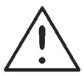

### 8.1 Digital inputs example

When the change at the digital input is recognized – e.g. push button is pressed, Railduino module sends this information to the control system immediately.  

{style="margin: 20px 0 0 0; width: 100%" } 

Example of command settings for sensing dig. input no. 13 in Loxone Config 

{style="margin: 20px 0 20px 0; width: 100%; border: 1px solid" }  
Insert new **virtual input command** and set the recognition command in the settings to:  
>rail1 di13 \v  

{ style="float: left; margin: 0 20px 0 0; max-width: 30px;" }
*In Virtual input command settings the checkbox Use as digital input must be* ***UNCHECKED***  
 
 
### 8.2 Relay outputs example

{ style="float: left; margin: 0 20px 0 0; max-width: 30px;" }
*Max. permissible voltage at relay outputs is 230V AC!*  

{ style="float: left; margin: 0 20px 0 0; max-width: 30px;" }
*Max. perm. load current is 7A at relay outputs no. 1,2,7,8*  

{ style="float: left; margin: 0 20px 0 0; max-width: 30px;" }
*Max. perm. load current is 4A at relay outputs no. 3,4,5,6,9,10,11,12*  

The Railduino module switches ON the relay output once the command is received from the superior system.  

{style="margin: 20px 0 0 0;  width: 100%" } 
Example of command settings for controlling relay output no. 7 in Loxone Config  

{style="margin: 20px 0 20px 0; width: 100%; border: 1px solid" } 
Insert new **virtual output command** and set the recognition commands in the settings:  
>rail1 ro7 on

in the Command for ON and  
>rail1 ro7 off

in the Command for OFF  

{ style="float: left; margin: 0 20px 0 0; max-width: 30px;" }
*In Virtual output command settings the checkbox Use as digital output must be* ***CHECKED***  
 

### 8.3 Dig. outputs (HSS or LSS) example

{ style="float: left; margin: 0 20px 0 0; max-width: 30px;" }
*When using two power supplies the output grounds must be connected!*  
{ style="float: left; margin: 0 20px 0 0; max-width: 30px;" }
*Max. perm. voltage at dig. outputs is 24V DC! Max. permi. load current is 2A per output!*  

Low side switch (LSS) is dig. output which connects the ground to the load = common GND is the same as Railduino’s 0V.
Terminal GND is internally connected to 0V.  
High side switch (HSS) is dig. output which connects voltage V+ (terminal V+) to the load.

{style="margin: 20px 0 0 0; width: 100%" }  
Example of controlling a digital output (high side switch - HSS) no. 1 in Loxone Config  

{style="margin: 20px 0 0 0; width: 100%" }  
Example of controlling a digital output (low side switch - LSS) no. 1 in Loxone Config  

{style="margin: 20px 0 20px 0; width: 100%; border: 1px solid" }  
Insert new **virtual output command** and set the recognition commands in the settings:  
>rail1 lo1 on

in the Command for ON and  
>rail1 lo1 off

in the Command for OFF 

Alternatively, you can control the digital output with PWM signal use command (as analog. output):
>rail1 lo1_pwm &lt;v&gt;
 

### 8.4 Analog inputs example

{ style="float: left; margin: 0 20px 0 0; max-width: 30px;"}
*Max. perm. voltage at the analog inputs is 10V DC!*  

The readings of analog inputs are made in cycles, and when the current value differs from the previous value, the module sends the new value to the superior system.  

The packets with measured values are sent in 10-bit format (0-1028), e.g. 127 = 5V  

Default cycle for measuring analog inputs is 10 s  

{style="margin: 20px 0 0 0; width: 100%" }  
Example of sensing water level with analog input AI1 in Loxone Config  

{style="margin: 20px 0 20px 0; border: 1px solid; width: 100%" }  
Insert new **virtual input command** and set the recognition command in the settings:  
>rail1 ai1 \v  

{ style="float: left; margin: 0 20px 0 0; max-width: 30px;" }
*In Virtual input command settings the checkbox Use as digital input must be* ***UNCHECKED***  
 

### 8.5 Analog outputs example

Analog outputs have common ground at the GND terminal, which is connected to 0V of Railduino module.

{ style="float: left; margin: 0 20px 0 0; max-width: 30px;"}
*Values of analog outputs are 0-10V, where required value of voltage is sent as bit value 0-255*

{style="margin: 20px 0 0 0; width: 100%" }  
Example of controlling a led driver with analog output AO1 in Loxone Config  

{style="margin: 20px 0 20px 0; width: 100%; border: 1px solid" }  
Insert new **virtual output command** and set the command for ON in the settings:  
>rail1 ao1 &lt;v&gt;  

### 8.6 Onewire bus example

It is possible to connect up to 10pcs of sensors to the module. The serial number of each sensor can be readout
 in the UDP monitor of the Loxone Config or in the Webserver of the module and then to use it in the command recognition settings.  

Common ground of the sensors is connected to the 0V power supply of the Railduino module.  

1wire sensors readings are made in cycles one by one sensors. Default scanning cycle is 30s.  

Supported types of the 1wire sensors:  
    • DS2438 – e.g. Unica 1wire modules  
    • DS18B20  

{ style="float: left; margin: 0 20px 0 0; max-width: 30px;"}
*Max. count of 1wire sensors is 10 pieces*

{style="margin: 20px 0 20px 0; width: 100%" }  
Example of connection of different 1wire sensors to the module

{style="margin: 20px 0 20px 0; width: 100%; border: 1px solid" } 
Example of command recognition settings for measurement of **temperature (sensor DS18B20)** in Loxone Config -
insert new virtual input command and set the command with 1wire sensor specific serial number 
>rail1 1w 28ff41778016559 \v  

{style="margin: 20px 0 20px 0; width: 100%; border: 1px solid" } 
Example of command recognition settings for measurement of **temperature (sensor DS2438)** in Loxone Config -
insert new virtual input command and set the command with 1wire sensor specific serial number 
>rail1 1w 264119210200001c \v  

{style="margin: 20px 0 20px 0; width: 100%; border: 1px solid" } 
Example of command recognition settings for measurement of **humidity (sensor DS2438)** in Loxone Config -
insert new virtual input command and set the command with 1wire sensor specific serial number 
>rail1 1w 264119210200001c \&#35; \v  

{style="margin: 20px 0 20px 0; width: 100%; border: 1px solid" } 
Example of command recognition settings for measurement of **light intensity (sensor DS2438)** in Loxone Config -
insert new virtual input command and set the command with 1wire sensor specific serial number 
>rail1 1w 264119210200001c \&#35; \&#35; \v  

{ style="float: left; margin: 0 20px 0 0; max-width: 30px;" }
*In virtual input command settings the checkbox Use as digital input must be* ***UNCHECKED***  
 

