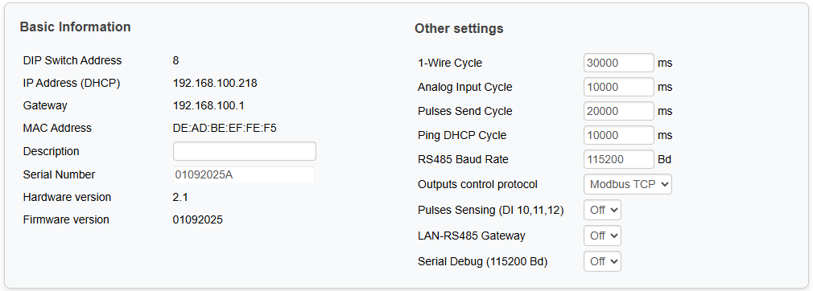
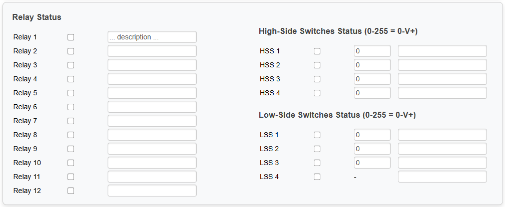
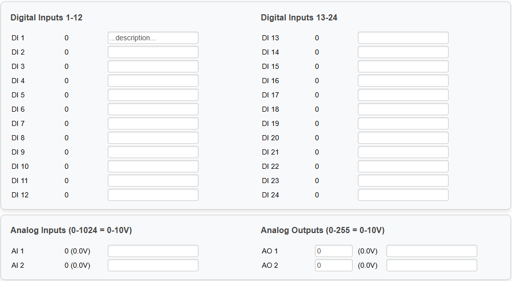
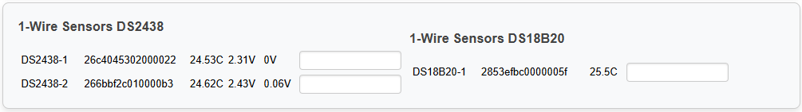

## Built-in Webserver

The webserver is accessible via HTTP and supports basic interaction with the module - enables remote monitoring and configuration of the device. 

!!! info "Main features"
	- **Basic information** - HW, IP, MAC Addresses, Description, Serial Number, HW Version, FW Version  
	- **Other settings** - Cycles, RS485 Baud Rate, Control protocol, Pulses Sensing, Gateway, Serial Debug
	- **Inputs and Outputs statuses and control** - Relays, Dig. Inputs/Outputs, Ana. Inputs/Outputs, 1-wire sensors
	- **Other features** - Protocol Documentation, Github Link, Save&Reboot buttons

## Basic information and Other settings

Basic info about the module with the possibility to add **Description** of the module. Other settings are set to default values and can be changed as requested:

!!! info "Other settings values limitation"
	1-wire Cycle - min.  **5s**, max  **60s**, default **30s**  
	Analog Input Cycle - min.  **2s**, max  **60s**, default **10s**  
	Pulses Send Cycle - min.  **2s**, max  **60s**, default **20s**  
	Ping DHCP Cycle - min.  **2s**, max  **60s**, default **10s**  
	RS485 Baud Rate - min.  **1200 Bd**, max  **115200 Bd**, default **115200 Bd**   

<figure markdown="span">

</figure>

## Relays and HSS/LSS outputs

This tab displays and allows control of **Relay states** (RO 1–12) and **HSS/LSS** (HSS 1–4, LSS 1–4). Just toggle a output on/off by checking the checkbox of the output. The HSS/LSS outputs can be used as **PWM outputs** with the value 0-255 in the field next to the output checkbox. You can add the **Description** to each output.
	
<figure markdown="span">

</figure>

## Digital inputs and Analog inputs/outputs

This tabs display **Digital inputs states** (DI 1–24) and **Analog inputs/outputs** (AI 1–2, AO 1–2). The analog outputs can be controlled with the values 0-255. You can add the **Description** to each input/output.
	
<figure markdown="span">

</figure>

## 1-wire sensors

This tab displays detected **1-wire sensors** (DS2438 or DS18B20) with according values - serial number and temperature value (Vad, Vcurr values for DS2438). You can add the **Description** to each sesnsor.
	
<figure markdown="span">

</figure>